# ┌─[ OMAR ]─┐ 

## 👋 About me 

---

## 🛠 tech stack

---

## 📊 github stats

---

## 🐍 contributions

---

## 🌌 vibes

> *Keep it minimal. Keep it dark. Keep it honest.*
>
> *Keep coding, keep exploring — from the microcosm of code to the macrocosm of the universe.*
> 
> *Coding my way through life, one line at a time.*

---

